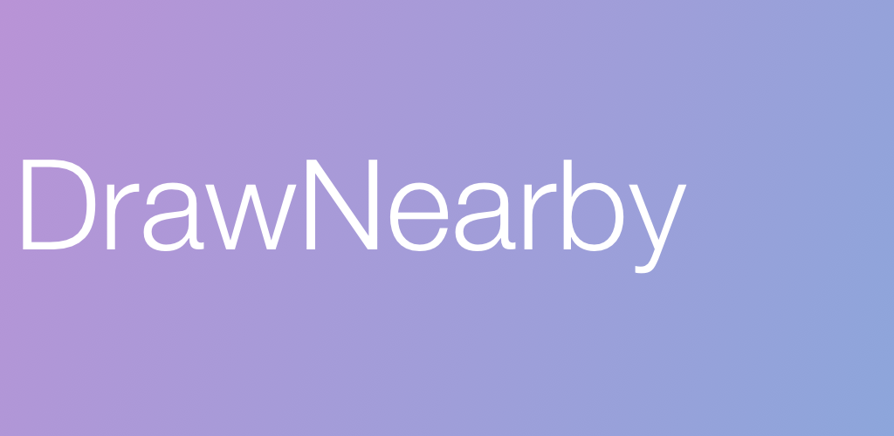

# DrawNearby

DrawNearby is an open source multiplayer drawing application. Simply create a room and start drawing 
with other folks! You can select different colors and and different sized brushes.

The application gives you two options to connect with users. The default strategy uses the Nearby 
Connections API which doesn't require a server. The alternative strategy requires a server that all 
devices connect to. [The server is also open-source](https://www.github.com/asadmshah/drawnearby_server)

### Running & Releasing

This application requires the following properties defined in `app/fabric.properties`:

- `apiSecret` - Fabric Build Secret
- `apiKey` - Fabric API Key

The following properties are also required in `local.properties`:

- `keystore.password` - Keystore Password
- `keystore.key.alias` - Keystore Alias
- `keystore.key.password` - Keystore Key Password

When releasing the keystore to use must be named `drawnearby.keystore` and should be located at the 
root of the project.
 
### TODO

- Switch from spaghetti to MVP (Lazy and unmotivated when starting out this project)
- Better handling of screen size variations
- Unit Tests
- Instrumentation Tests
- Test Tests
- Lots of other stuff.

### License

    Copyright 2016 Asad Shah

    Licensed under the Apache License, Version 2.0 (the "License");
    you may not use this file except in compliance with the License.
    You may obtain a copy of the License at

       http://www.apache.org/licenses/LICENSE-2.0

    Unless required by applicable law or agreed to in writing, software
    distributed under the License is distributed on an "AS IS" BASIS,
    WITHOUT WARRANTIES OR CONDITIONS OF ANY KIND, either express or implied.
    See the License for the specific language governing permissions and
    limitations under the License.
    